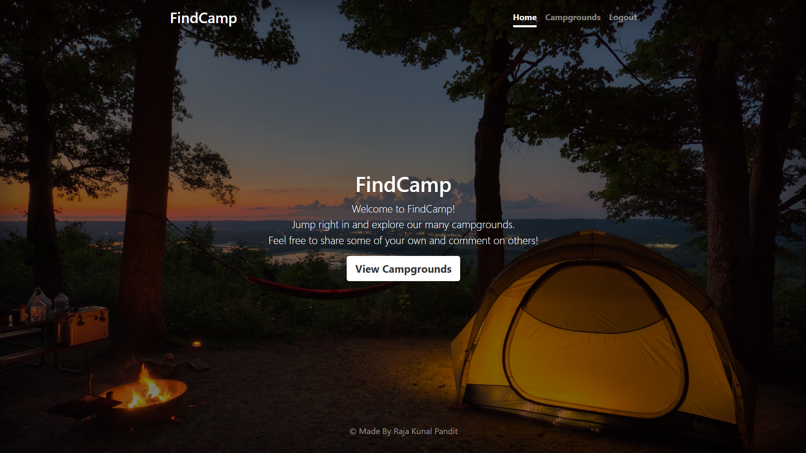
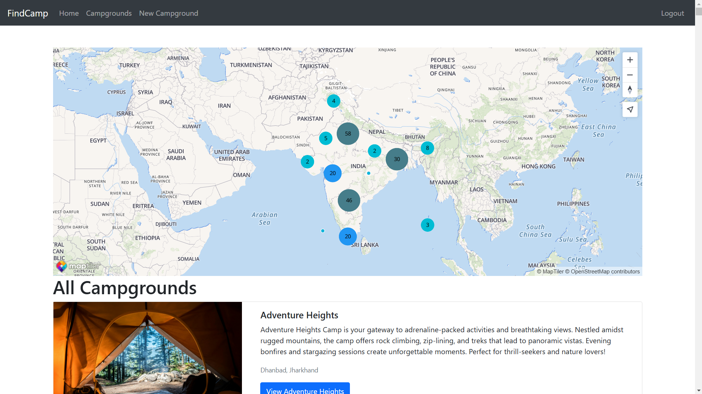
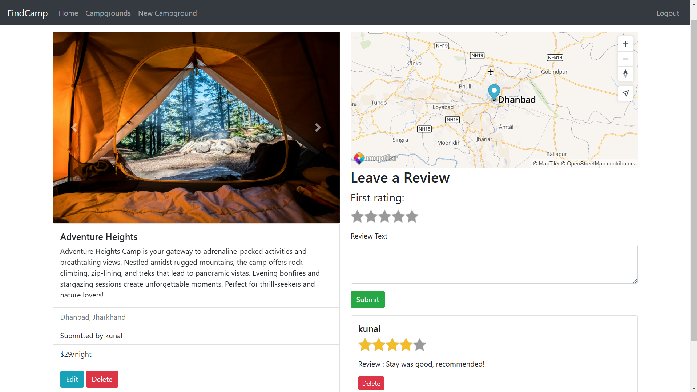
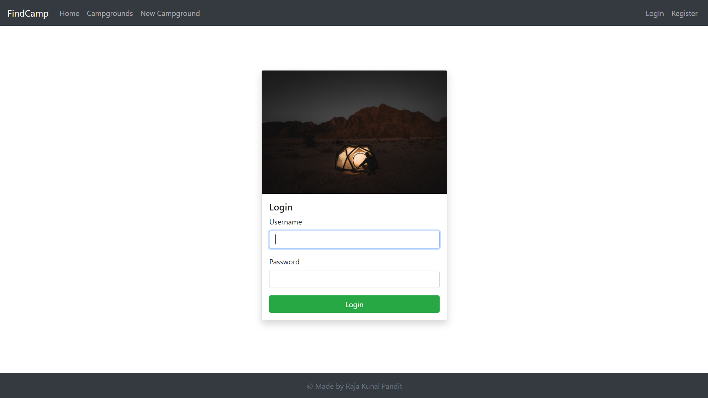

# FindCamp
A full-stack web application developed using Express JS, MongoDB, and EJS and Bootstrap 5.it's a vibrant community-driven hub that empowers users to explore, rate, and contribute their experiences with various campgrounds. This app supports posts management (creating, editing, and deleting), image uploading, responsive design with added security and PassportJS authentication. 

## Demo-Preview && Screenshots


* HomePage
  


* CampGrounds Page
  


*Campground



*Login Page



## Features

* Authentication:
  - User login with username and password

* Authorization
  - One cannot manage posts and view user profile without being authenticated
  - One cannot edit or delete posts and comments created by other users

* Manage campground posts with basic functionalities:

  - Create, edit and delete posts and comments

  - Upload campground photos

  - Display campground location on MapTiler

  - Search existing campgrounds

* Manage user account with basic functionalities

  - Flash messages responding to users' interaction with the app

  - Responsive web design

  - Update campground photos when editing campgrounds

# Technology Stack

<h3 align="left">Languages and Tools:</h3>
<p align="left">
    <a href="https://www.w3.org/html/" target="_blank">  </a>
    <a href="https://www.w3schools.com/css/" target="_blank">  </a>
    <a href="https://getbootstrap.com/" target="_blank">  </a>
    <a href="https://developer.mozilla.org/en-US/docs/Web/JavaScript" target="_blank">  </a>
      <a href="https://nodejs.org" target="_blank">  </a>
    <a href="https://expressjs.com" target="_blank">  </a>
    <a href="https://ejs.co/" target="_blank">  </a>
    <a href="https://www.mongodb.com/" target="_blank">  </a>
    <a href="https://mongoosejs.com//" target="_blank">  </a>
    </p>

* HTML5 - markup language for creating web pages and web applications

* CSS3 - used for describing the presentation of a document written in a markup language

* Bootstrap - free and open-source front-end web framework for designing websites and web applications quickly

* jQuery - cross-platform JavaScript library designed to simplify the client-side scripting of HTML

* DOM Manipulation - is a platform and language-neutral interface that allows programs and scripts to dynamically access and update the content, structure, and style of a document

* Node.js - pen-source, cross-platform JavaScript run-time environment for executing JavaScript code server-side

* Express.js - for building web applications and APIs and connecting middleware

* REST - REST (REpresentational State Transfer) is an architectural style for developing web services

* MongoDB - open-source cross-platform document-oriented NoSQL database program to store details like users info, campgrounds info and comments

* PassportJS - authentication middleware for Node.js. Extremely flexible and modular, Passport can be unobtrusively dropped in to any Express-based web application

* Data Associations - associating user data with the respective campgrounds and comments using reference method

- NPM tools:
  - Mongoose
  - Passport.js: handle authentication
  - Joi: schema description & data validation
  - helmet: helps secure the app by setting various HTTP headers
  - express-mongo-sanitize: prevent MongoDB Operator Injection


### Run it Locally
1. Clone the repository:
```bash 
https://github.com/RajaKunalPandit1/FindCamp.git
```
2. Install dependencies:
```bash 
cd FindCamp
npm install
```
3. Set up environment variables:
Create a `.env` file in the root directory of the project and add the following environment variables:
```bash
# Cloudinary Configuration
CLOUDINARY_CLOUD_NAME=your_cloud_name
CLOUDINARY_API_KEY=your_api_key
CLOUDINARY_SECRET=your_secret_key

# Mapbox Configuration
MAPTILER_API_KEY=your_maptiler_Api

# Database URL
DB_URL=your_database_url
```
Replace these placeholders with your actual values when setting up the environment variables.

4. Start running your app:
```bash 
node app.js
```
This will start the server at [http://localhost:3000](http://localhost:3000).
